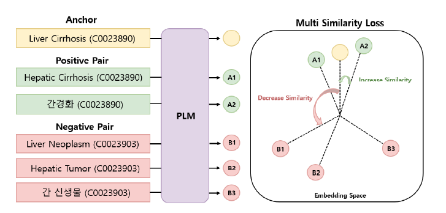

# 🍊 SapBERT-KO-EN

- 한국어 모델을 이용한 **SapBERT**(Self-alignment pretraining for BERT)입니다.
- 한·영 의료 용어 사전인 KOSTOM을 사용해 한국어 용어와 영어 용어 정렬합니다.
- 참고: [SapBERT](https://aclanthology.org/2021.naacl-main.334.pdf), [Original Code](https://github.com/cambridgeltl/sapbert) 

&nbsp;

## 1. SapBERT-KO-EN

- SapBERT는 수많은 **의료 동의어**를 동일한 의미로 처리하기 위한 사전 학습 방법론입니다.
- Multi-Similarity Loss를 이용해 **동일한 의료 코드**를 지닌 용어 간의 유사도를 키우는 방식으로 학습합니다.

<p align="center">

</p>

- 한국 의료 기록은 **한·영 혼용체**로 이루어져 있어 한·영 용어 간의 동의어까지 처리해야 합니다.  
- **SapBERT-KO-EN**는 이 문제를 해결하기 위해 한국어 용어와 영어 용어를 모두 정렬한 모델입니다.  

&nbsp;&nbsp;&nbsp;&nbsp;(※위 그림은 )

## 2. Model Structure

- 성능 향상을 위해 Bi-Encoder 구조를 **Single-Encoder 구조**로 변경했습니다. [\[code\]]()
- Pytorch Metric Learning 패키지를 사용하지 않고 Multi Simliarity Loss를 직접 구현했습니다. [\[code\]]()
  

## 3. Training Data
- 의료 용어 사전으로, 영어 중심의 UMLS 대신 한국어 중심의 **KOSTOM**을 사용했습니다.   
- KOSTOM은 모든 한국어 용어에 대응하는 영어 용어 및 다양한 종류의 의료 코드를 함께 제시합니다.
- Pre-processing을 통해 동일한 코드를 지닌 용어들을 '쌍(pair)'으로 구성해 학습 데이터를 구축합니다.
```

```

&nbsp;


## 4. Implementation


## 5. Example
