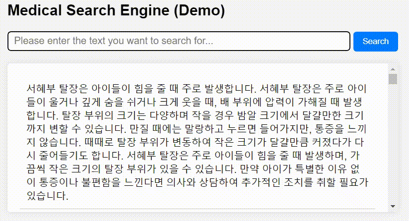

# 🍊 SapBERT-KO-EN

- 한국어 모델을 이용한 **SapBERT**(Self-alignment pretraining for BERT)입니다.
- 한·영 의료 용어 사전인 KOSTOM을 사용해 한국어 용어와 영어 용어 정렬합니다.
- 참고: [SapBERT](https://aclanthology.org/2021.naacl-main.334.pdf), [Original Code](https://github.com/cambridgeltl/sapbert) 

 

## 1. SapBERT-KO-EN

- SapBERT는 수많은 **의료 동의어**를 동일한 의미로 처리하기 위한 사전 학습 방법론입니다.
- Multi-Similarity Loss를 이용해 **동일한 의료 코드**를 지닌 용어 간의 유사도를 키우는 방식으로 학습합니다.

<p align="center">

</p>

- 한국 의료 기록은 **한·영 혼용체**로 이루어져 있어 한·영 용어 간의 동의어까지 처리해야 합니다.  
- **SapBERT-KO-EN**는 이 문제를 해결하기 위해 한국어 용어와 영어 용어를 모두 정렬한 모델입니다.  

&nbsp;&nbsp;&nbsp;&nbsp;(※위 그림은 )

## 2. Model Structure

- 성능 향상을 위해 Bi-Encoder 구조를 **Single-Encoder 구조**로 변경했습니다. [\[code\]](https://github.com/snumin44/SapBERT-KO-EN/blob/main/src/model.py)
- Pytorch Metric Learning 패키지를 사용하지 않고 Multi Simliarity Loss를 직접 구현했습니다. [\[code\]](https://github.com/snumin44/SapBERT-KO-EN/blob/main/src/loss.py)
  

## 3. Training Data
- 의료 용어 사전으로, 영어 중심의 UMLS 대신 한국어 중심의 **KOSTOM**을 사용했습니다.   
- KOSTOM은 모든 한국어 용어에 대응하는 영어 용어 및 다양한 종류의 의료 코드를 함께 제시합니다.
- Pre-processing을 통해 동일한 코드를 지닌 용어들을 '쌍(pair)'으로 구성해 학습 데이터를 구축합니다.
```
sent0, sent1, label
간경화, Liver Cirrhosis, C0023890
간경화, Hepatic Cirrhosis, C0023890
Liver Cirrhosis, Hepatic Cirrhosis, C0023890
...
```

## 4. Implementation

**(1) Pre-processing**
- **'kostom_preprocessing.ipynb'** 를 이용해 KOSTOM을 학습을 위한 데이터 셋으로 변환할 수 있습니다. [\[code\]](https://github.com/snumin44/SapBERT-KO-EN/tree/main/data)

**(2) Training**
- train 디렉토리의 쉘 스크립트를 이용해 모델을 학습할 수 있습니다. [\[code\]](https://github.com/snumin44/SapBERT-KO-EN/tree/main/train)
- 쉘 스크립트에서 베이스 모델 및 하이퍼 파라미터를 직접 수정할 수 있습니다.  
```
cd train
sh run_train.sh
```
## 5. Training Example
- 모델 학습에 활용한 베이스 모델 및 하이퍼 파라미터는 다음과 같습니다.
  - Model : klue/bert-base
  - Epochs : 1
  - Batch Size : 64
  - Max Length : 64
  - Dropout : 0.1
  - Pooler : 'cls'
  - Eval Step : 100
  - Threshold : 0.8
  - Scale Positive Sample : 1
  - Scale Negative Sample : 60

- 어휘 사전에 영어 토큰이 포함되었다면 **한국어 모델**도 사용할 수 있습니다.
  - 학습 전 한·영 의료 용어를 어휘 사전에 추가하는 것도 가능합니다.
  - 다국어 모델인 XLM-RoBERTa 모델도 코드 수정 없이 바로 사용할 수 있도록 구현했습니다.
    
- 학습 모델의 체크 포인트는 [HuggingFace 레포](https://huggingface.co/snumin44/sap-bert-ko-en)에서 다운로드 할 수 있습니다. 

```python
import numpy as np
from transformers import AutoModel, AutoTokenizer

model_path = 'snumin44/sap-bert-ko-en'
model = AutoModel.from_pretrained(model_path)
tokenizer = AutoTokenizer.from_pretrained(model_path)

query = '간경화'

targets = [
    'liver cirrhosis',
    '간경변',
    'liver cancer',
    '간암',
    'brain tumor',
    '뇌종양'
]

query_feature = tokenizer(query, return_tensors='pt')
query_outputs = model(**query_feature, return_dict=True)
query_embeddings = query_outputs.pooler_output.detach().numpy().squeeze()

def cos_sim(A, B):
    return np.dot(A, B) / (np.linalg.norm(A) * np.linalg.norm(B))

for idx, target in enumerate(targets):
    target_feature = tokenizer(target, return_tensors='pt')
    target_outputs = model(**target_feature, return_dict=True)
    target_embeddings = target_outputs.pooler_output.detach().numpy().squeeze()
    similarity = cos_sim(query_embeddings, target_embeddings)
    print(f"Similarity between query and target {idx}: {similarity:.4f}")
```
```
Similarity between query and target 0: 0.7145
Similarity between query and target 1: 0.7186
Similarity between query and target 2: 0.6183
Similarity between query and target 3: 0.6972
Similarity between query and target 4: 0.3929
Similarity between query and target 5: 0.4260
```

## 6. Fine-tuning Example

- 논문에서는 **Medical Entity Linking** 테스크에 대해 Fine-tuning 을 진행했습니다.
- 다음과 같이 **Medical QA** 데이터 셋을 이용해 검색 모델로 Fine-tuning 하는 것도 가능합니다.
  - Medical QA 데이터 셋으로 AI Hub의 **'초거대 AI 헬스케어 질의응답 데이터'** 데이터 셋을 이용했습니다.
  - 베이스 모델은 'snumin44/sap-bert-ko-en'을 사용했고, [DPR-KO 코드](https://github.com/snumin44/DPR-KO)로 Fine-tuning을 진행했습니다.   

<p align="center">

</p>
